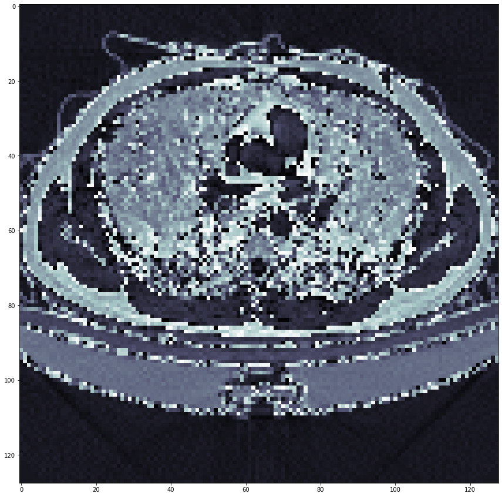
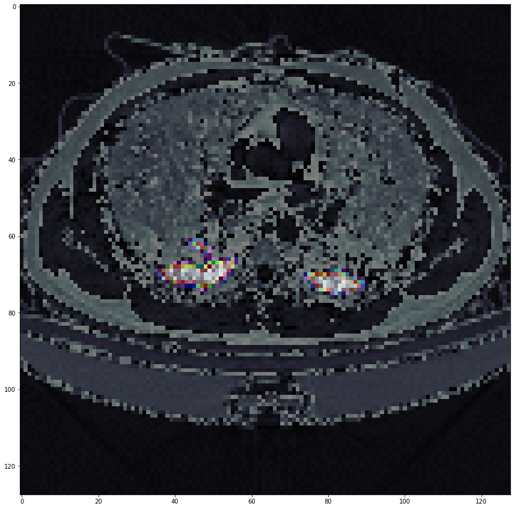
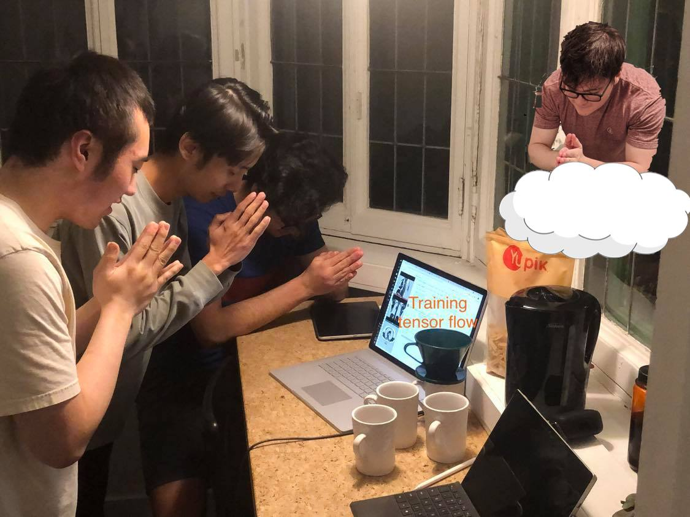

# COVID-19 CT Infection Segmentation

A hackathon project from MAIS Hacks (October 2021). We trained a **U-Net** to find COVID-19 infection regions in lung CT scans, and wrapped it in a small desktop "Virtual Doctor" chat app. You give the app a CT slice, and it returns the scan with the predicted infection overlaid.

<p align="center">
  
  
  <br />
  <em>Left: input CT slice. Right: the model's predicted infection regions, overlaid.</em>
</p>

> ⚠️ This was a hackathon prototype for learning purposes. It is **not** a medical device and must not be used for diagnosis.

## How it works

### Data
- The [COVID-19 CT scans dataset](https://www.kaggle.com/datasets/andrewmvd/covid19-ct-scans) on Kaggle: 20 CT volumes with expert-labelled lung and infection masks, in NIfTI format.
- Each volume is split into 2D slices, and each slice is resized to 256×256. That gave **11,420 slices**, split 80/20 into **9,136 for training and 2,284 for validation**.
- Infection masks are converted to binary (infected or not) for pixel-wise segmentation.

### Model
- A **U-Net with a ResNet-34 encoder**, from [`segmentation_models`](https://github.com/qubvel/segmentation_models), trained from scratch (no pretrained weights) on single-channel CT slices. It has about 24.4M parameters.
- Training used binary cross-entropy loss, the Adam optimizer (learning rate 0.005), and batch size 32, for 91 epochs in Google Colab.

### Results
| Metric | Training | Validation |
|---|---|---|
| IoU (intersection over union) | 0.935 | **0.903** (best: 0.906) |

IoU compares the predicted infection area with the expert-labelled area: 1.0 means a perfect match. These are the final-epoch scores from the training notebook.

### App
`CovidApp.py` is a Tkinter chat window called "Virtual Doctor":
1. Type `hello` to get a greeting.
2. Type the path to a CT image (`.png` or `.jpeg`).
3. The app loads `covidModel.h5` and runs the image through the U-Net. It shows the original image, then the image with the predicted infection map overlaid, which it also saves as `segmentedImage.jpg`.

## Repository contents

| File | Description |
|---|---|
| `Covid_Detection.ipynb` | Training notebook: downloading the data, preprocessing, and training and evaluating the U-Net. Also on [Google Colab](https://colab.research.google.com/drive/1IKG1SnVoQDJIi0XAMd1w5IYKZBZKYD1Z?usp=sharing). |
| `covid_detection.py` | The same notebook exported as a Python script. It uses Colab shell commands, so run it in Colab or Jupyter. |
| `CovidApp.py` | The desktop app |
| `covidModel.h5` | Trained Keras model used by the app. The best checkpoint from training was too large to upload; you can re-create it by running the Colab notebook. |
| `covidImage.png`, `segmentedImage2.jpg` | Example input and output |

## Running it

### The app
```bash
pip install tensorflow opencv-python pillow matplotlib numpy
python CovidApp.py
```
Tkinter comes with most Python installs; on some Linux distributions you need to install `python3-tk` separately. Run the app from the repository folder so it can find `covidModel.h5`.

### Training
Open the [Colab notebook](https://colab.research.google.com/drive/1IKG1SnVoQDJIi0XAMd1w5IYKZBZKYD1Z?usp=sharing). Downloading the dataset needs your own Kaggle API token: create it under **Kaggle → Settings → API**, and upload it when the notebook asks. Don't commit your `kaggle.json` to a repository.

## Team

<p align="center">
  
  <br />
  <em>The team, hoping TensorFlow finishes training.</em>
</p>
